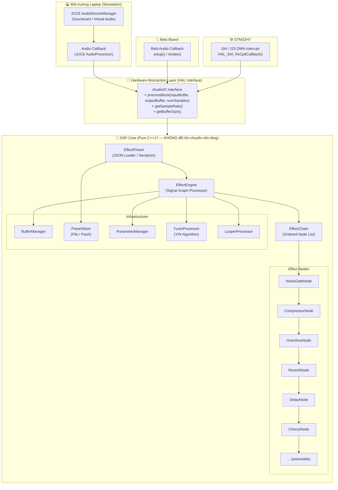

```mermaid

flowchart TB 
	subgraph LAPTOP["💻 Môi trường Laptop (Simulation)"]
	 
		LA["JUCE AudioDeviceManager\n(Soundcard / Virtual Audio)"] 
		LB["Audio Callback\n(JUCE AudioProcessor)"] 
	end
	
	subgraph BELA["🔌 Bela Board"]
	    BA["Bela Audio Callback\nsetup() / render()"]
	end
	
	subgraph STM32["⚙️ STM32H7"]
	    SA["SAI / I2S DMA Interrupt\nHAL_SAI_RxCpltCallback()"]
	end
	
	subgraph HAL["🔁 Hardware Abstraction Layer (HAL Interface)"]
	    HC["IAudioIO Interface\n+ processBlock(inputBuffer, outputBuffer, numSamples)\n+ getSampleRate()\n+ getBufferSize()"]
	end
	
	subgraph DSP_CORE["🧠 DSP Core (Pure C++17 — KHÔNG đổi khi chuyển nền tảng)"]
	    direction TB
	    PE["EffectPreset\n(JSON Loader / Serializer)"]
	    EE["EffectEngine\n(Signal Graph Processor)"]
	    EC["EffectChain\n(Ordered Node List)"]
	
	    subgraph EFFECTS["Effect Nodes"]
	        EF1["NoiseGateNode"]
	        EF2["CompressorNode"]
	        EF3["OverdriveNode"]
	        EF4["ReverbNode"]
	        EF5["DelayNode"]
	        EF6["ChorusNode"]
	        EFN["... (extensible)"]
	    end
	
	    subgraph INFRA["Infrastructure"]
	        BM["BufferManager"]
	        PM["ParameterManager"]
	        PS["PresetStore\n(File / Flash)"]
	        TU["TunerProcessor\n(YIN Algorithm)"]
	        LO["LooperProcessor"]
	    end
	
	    PE --> PS
	    PE --> EE
	    EE --> EC
	    EC --> EF1 --> EF2 --> EF3 --> EF4 --> EF5 --> EF6 --> EFN
	    EE --> BM
	    EE --> PM
	    EE --> TU
	    EE --> LO
	end
	
	LA --> LB --> HC
	BA --> HC
	SA --> HC
	HC --> DSP_CORE
```

![[DSP Architecture - Platform Abstraction.png]]